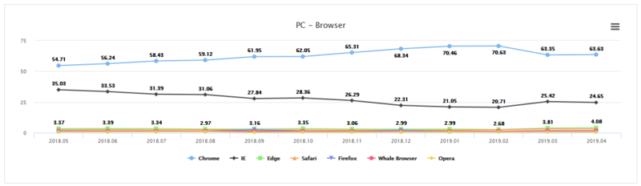

# 디자인 설계 의사 결정

## 개요

 UX / UI에 필요한 디자인을 결정하기에 앞서 우리는 어떤 브라우저에 맞출 것인지 정한다.

## 결론 : Chrome을 제외한 모든 브라우저 제외

 우선, Stones\_in\_greenhouse가 국군 장병을 위한 것이므로 국내 웹브라우저 점유율을 가지고 왔다. 보여지는 자료에선 Chrome이 압도적으로 높으며, 여러개의 브라우저에 맞게 설계하는 것 보다 점유율이 높은 브라우저 하나에 설계하는 것이 이번 해커톤에는 어울린다고 생각하였다.

|  |  |
| :--- | :--- |
| Chrome\_Version | 86.0.4240.75\(공식 빌드\) \(64비트\) |

