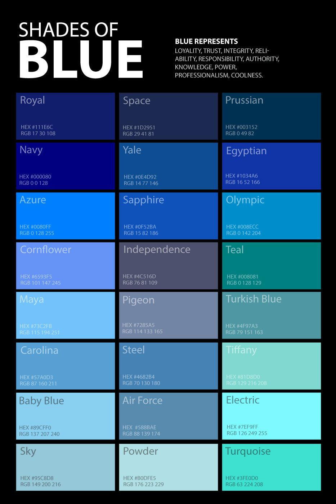

# 디자인 컨셉 및 기능 정의

## UI/UX 컨셉 정의

### 기기 분석

 우리의 주 타겟은 국군장병이다. 이들이 이용할 수 있는건 사이버지식정보방과 모바일이 끝이다. 그래고 사이버 지식정보방의 모니터는 보급형으로 대체적으로 모니터 크기와 사용하는 해상도가 \(1920 X 1080 \)로 똑같다. 그래서 1차적으론 \(1920 X 1080 \)에 맞춰서 제작을한다. 하지만 상담을 통해 민감한 부분을 드러내는 내용이 있을 수 있으므로, 화면을 줄이거나 모바일을 통해 상담을 하는 인원이 있을 것이다. 이를 생각하여 2차적으로 반응형 웹페이지로 제작을 한다. 

## 색상 및 글꼴 선택

### 색상

 아무래도 상담서비스이기에 색상이 중요할 수 밖에없다. 마음에 안정을 주는 색감으로는 초록색과 파란색이 있는데 우리는 메인페이지에 소개가 들어가기에 흰색과 잘어울리 파랑의 조화를 택했다.

 여기서도 밝고 경쾌한 느낌을 주는 계열이 아닌 차분한 느낌을 주고 "Azure", "Navy" 처럼 살짝 어두운 파랑과의 조화를 택했다.

### 글꼴

 사실 글꼴은 날카로운 느낌의 글꼴만 아니면 된다고 생각을하다가 LOGO로 대체할 수 있는 글꼴을 찾으면 시간적으로도 여유가 생기고 우리 팀 이름을 바로 알릴 수 있을 것 같아서 LOGO에 어울리는 글꼴을 찾기로 했다.

