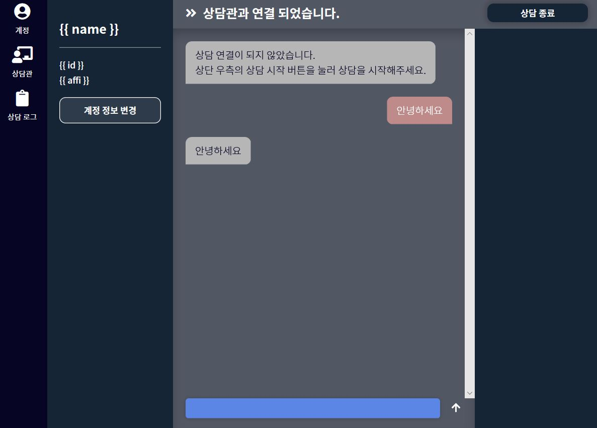

# 컴포넌트 디자인

## 메인페이지

 상담을 위한 서비스이기도 하지만 그 전에 해커톤 출품작임을 생각하여 우리는 메인페이지\(첫 화면\)에 로그인과 회원가입, 서비스 소개글을 넣기로 하였다. 깃허브를 모티브로 하면 디자인이 깔끔한 느낌을 줄 것 같아, 깃허브처럼 한 페이지씩 기능, 소개하는 것으로 분류하였다.

## 채팅 페이지

 사실 모바일화면의 크기가 채팅하는 UI에 제일 최적화된 크기인것 같다. 일단 웹에서 채팅 페이지를 구현해야하니, 채팅만 하는 공간을 넣는 것이 아니라 부가적인 공간도 넣는 것이 좋을 것 같다는 생각을 했다. 디자인 시안을 찾던 중 '크몽'의 채팅화면을 보고 유사하게 디자인하고자 했다.

아래는 채팅화면 디자인 시안이다.

