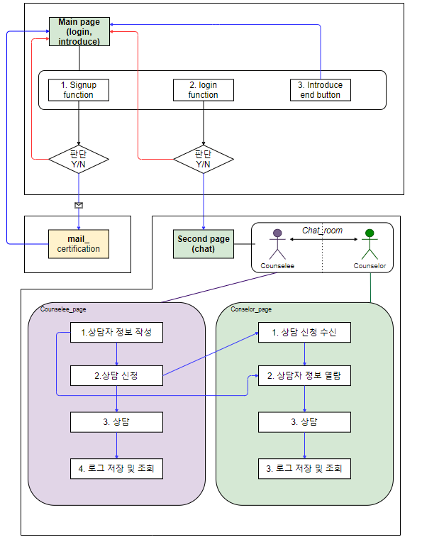

# 화면 흐름도

### 화면은 크게 Main page와 Second page로 구성되어 있다.

### Main\_page


* Signup function
* Login function
* Introduce, end button


 Main\_page는 크게 세가지의 기능이 한번에 들어있다. 우선 Signup\_function을 통해 본인 Mail에 인증을 보내고 그 메일로 유효한 고객인지 확인한다.

 Introduce, end button은 메인페이지에 보여주는 우리 서비스의 소개와 페이지를 아래까지 내렸을 때 end button이 있는데 이 button을 클릭하면 다시 page의 상단으로 올려주는 역할을 한다.

 Login\_function은 단순히 두번째 페이지로 넘어가기 위한 기능이다.

### Second\_page


* Chat function


