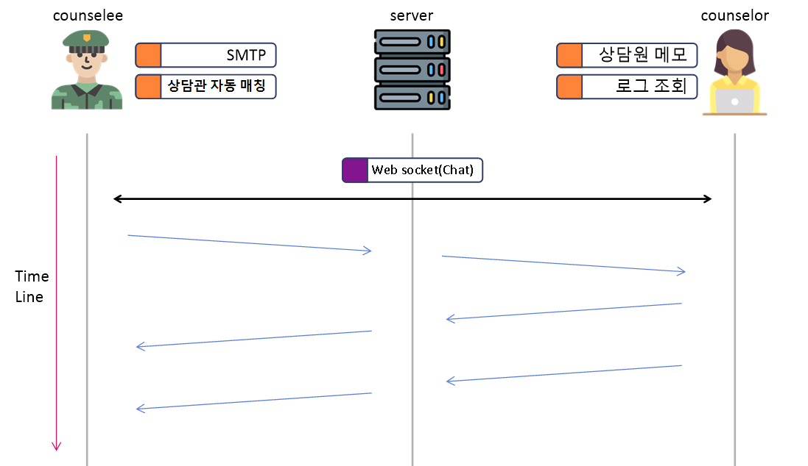

# 시스템 구조 설계

## 개요

가장 핵심적이며 중요한 기능들을 기준으로 시스템 구조를 설계하고, 이를 기반으로 DB구조를 설계한다.

## 기능적 모델링

### Counselee

회원가입을 위해 SMTP로 본인인증을 하는 기능과 부대에 속해 있는 상담원을 자동으로 매칭해줘야한다.

### Counselor 

익명으로 상담하기 때문에 개인별로의 특징을 메모를 할 수 있는 기능과 대화 내역을 불러오는 로그 조회 기능이 필요하다.

### Chat

원활한 서비스를 진행하기 위해 웹 소켓을 이용한다. 채팅 내역은 시간을 기준으로 로그에 남게된다.

