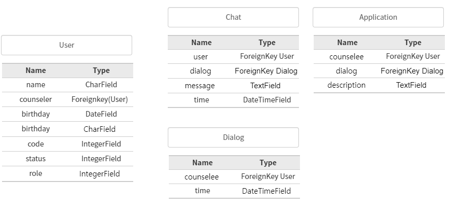

# DB 구조 설계 및 명세

## DB 요구사항

데이터베이스 설계에 있어 반드시 다음과 같은 사항은 준수 및 지향하도록 한다.

Counselee

* 상담 서비스에 회원가입을 하려면 이름 , 아이디\(이메일\), 비밀번호, 비밀번호 확인, 생년월일, 소속을 입력해야한다. 
  * 비밀번호 확인의 경우 Front에서 확인하고, 비밀번호만 DB에 남긴다.
* 로그인을 하려면 아이디, 비밀번호를 입력해야한다.
* 소속 근처의 상담관을 매칭시켜준다.
* 상담이 끝나는 즉시 채팅내용이 저장된다.

COUNSELOR

* 이미 근무중인 군 상담관들의 ID와 PW를 소속을 기준으로 입력받는다.
* 상담관의 경우 여러명과 상담할 수 있으며, 마찬가지로 대화 기록이 남는다.
* 추가적으로 상담자의 특이사항을 상담자 별 메모할 수 있다.

## DB 테이블 명세

