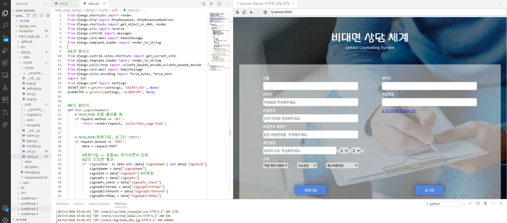
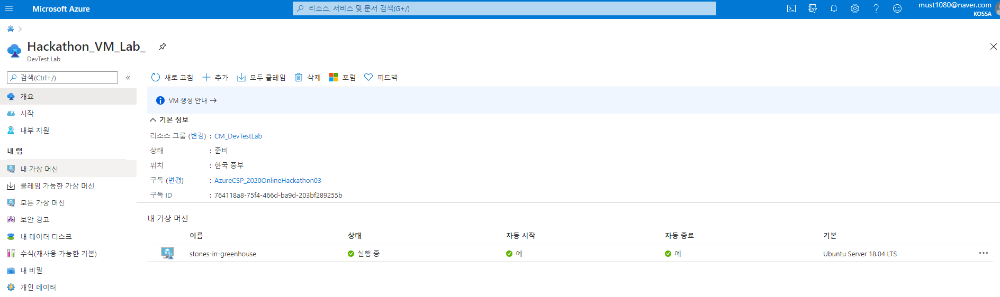

# BACKEND

## BACKEND 작업





## Main\_Page

views.py

```python

#메인 페이지
def Main_page(request):
    # MAIN_PAGE 처음 들어올 때
    if request.method == 'GET':
        return render(request, 'polls/Main_page.html')


    # MAIN_PAGE(회원가입, 로그인 (POST))
    if request.method == 'POST':
        data = request.POST
        
        #회원가입 => 로컬URL 유지하면서 반환
        #값이 있다면 통과
        if 'signUpName' in data and (data['signUpName'] and data['signUpId'] and data['signUpPw'] and data['signUpPw_check'] and data['signUpBirthYear'] and data['signUpBirthMonth'] and data['signUpBirthDay']):
            signUpName = data["signUpName"]
            signUpId = data["signUpId"] #이메일
            signUpPw = data["signUpPw"]
            signUpPw_check = data["signUpPw_check"]
            signUpBirthYear = data["signUpBirthYear"]
            signUpBirthMonth = data["signUpBirthMonth"]
            signUpBirthDay = data["signUpBirthDay"]

            #이메일 인증 할 사용자 생성
            a = 1
            if a == 2:
                pass
            else:
                data = {
                'id': signUpId,
                'name' : signUpName,
                'pw': signUpPw
                }
                token_ = jwt.encode(data, SECRET_KEY, ALGORITHM)
                token = token_.decode('utf-8')
                #이메일 인증
                context = {
                #'title' : "제목",
                'email' : signUpId,
                    #'message' : "안녕하세요"
                    'token' : token
                    }
                emailContent = render_to_string('polls/email.html', context)
                email = EmailMessage("온실 속 돌멩이 인증메일입니다.", emailContent, to = [signUpId])
                email.content_subtype = "html"
                result = email.send()      

            #이메일이 성공적으로 발송되면 
            #의문, 이메일이 뭐든 간에 항상 1값이 전해진다.
                if result == 1:
                #messages.info(request, "성공적으로 보냈습니다.")
                    return render(request, 'polls/Main_page.html', {"result" : result, "signUpId" : signUpId })
        
                else:
                    return render(request, 'polls/Main_page.html', {"result" : result, "signUpId" : signUpId})


                return render(request, 'polls/Main_page.html')
        
        #로그인 => 로컬URL 유지하면서 Chat_page.html(api) 반환
        #값이 있다면 통과
        elif 'login_id' in data and ( data['login_id'] and data['login_pw']):

            #로그인 값 받아오기  
            login_id = data["login_id"]
            login_pw = data["login_pw"]

            #다른 api 연동해야하니 rendirect 써야함   
            return render(request, 'polls/Chat_page.html')
        
        #회원가입, 로그인 둘다 한 칸이라도 비었을 겅우
        else:
            return render(request, 'polls/Main_page.html', {"error" : "유효하지 않은 값입니다."})


#이메일 활성화page
def email_activate(request, token):
    payload = jwt.decode(token, SECRET_KEY, ALGORITHM)
    name = payload['name']
    result = True
    return render(request, 'polls/mail_success.html', {"mail_success": result, "signName" : name} )

#로그인 정보를 잊으셨습니까?
def forget(request):
    return render(request, 'polls/forget.html')
```

urls.py

```python
from django.urls import path
from . import views

urlpatterns = [
    # main url ( url 통일을 위해 Chat_page, signup_page 통합)
    path('', views.Main_page, name='Main_page'),     
    path('email_activate/<token>', views.email_activate , name='email_activate'),
    path('forget', views.forget, name='forget.html')
]
```

settings.py

```python
"""
Django settings for mysite project.

Generated by 'django-admin startproject' using Django 3.1.1.

For more information on this file, see
https://docs.djangoproject.com/en/3.1/topics/settings/

For the full list of settings and their values, see
https://docs.djangoproject.com/en/3.1/ref/settings/
"""
from django.contrib.messages import constants as messages_constants
from pathlib import Path
import os


# Build paths inside the project like this: BASE_DIR / 'subdir'.
BASE_DIR = Path(__file__).resolve().parent.parent

MESSAGE_LEVEL = messages_constants.DEBUG

# Quick-start development settings - unsuitable for production
# See https://docs.djangoproject.com/en/3.1/howto/deployment/checklist/

# SECURITY WARNING: keep the secret key used in production secret!
SECRET_KEY = 'ukqqou*=t)x-hzge+cny9(zau_kkbr=y0w0pig1&m8ak01coya'
ALGORITHM = 'HS256'

# SECURITY WARNING: don't run with debug turned on in production!
DEBUG = True
#python manage.py runserver 0:8000
#ALLOWED_HOSTS = ["13.124.47.29"]
ALLOWED_HOSTS = []


# Application definition

INSTALLED_APPS = [
    'django.contrib.admin',
    'django.contrib.auth',
    'django.contrib.contenttypes',
    'django.contrib.sessions',
    'django.contrib.messages',
    'django.contrib.staticfiles',
    'polls',
    'django_inlinecss'
]

MIDDLEWARE = [
    'django.middleware.security.SecurityMiddleware',
    'django.contrib.sessions.middleware.SessionMiddleware',
    'django.middleware.common.CommonMiddleware',
    #'django.middleware.csrf.CsrfViewMiddleware',
    'django.contrib.auth.middleware.AuthenticationMiddleware',
    'django.contrib.messages.middleware.MessageMiddleware',
    'django.middleware.clickjacking.XFrameOptionsMiddleware',
]

ROOT_URLCONF = 'mysite.urls'

TEMPLATES = [
    {
        'BACKEND': 'django.template.backends.django.DjangoTemplates',
        'DIRS': [],
        'APP_DIRS': True,
        'OPTIONS': {
            'context_processors': [
                'django.template.context_processors.debug',
                'django.template.context_processors.request',
                'django.contrib.auth.context_processors.auth',
                'django.contrib.messages.context_processors.messages',
            ],
        },
    },
]

WSGI_APPLICATION = 'mysite.wsgi.application'


# Database
# https://docs.djangoproject.com/en/3.1/ref/settings/#databases

DATABASES = {
    'default': {
        'ENGINE': 'django.db.backends.sqlite3',
        'NAME': BASE_DIR / 'db.sqlite3',
    }
}


# Password validation
# https://docs.djangoproject.com/en/3.1/ref/settings/#auth-password-validators

AUTH_PASSWORD_VALIDATORS = [
    {
        'NAME': 'django.contrib.auth.password_validation.UserAttributeSimilarityValidator',
    },
    {
        'NAME': 'django.contrib.auth.password_validation.MinimumLengthValidator',
    },
    {
        'NAME': 'django.contrib.auth.password_validation.CommonPasswordValidator',
    },
    {
        'NAME': 'django.contrib.auth.password_validation.NumericPasswordValidator',
    },
]


# Internationalization
# https://docs.djangoproject.com/en/3.1/topics/i18n/

LANGUAGE_CODE = 'en-us'

TIME_ZONE = 'UTC'

USE_I18N = True

USE_L10N = True

USE_TZ = True


# Static files (CSS, JavaScript, Images)
# https://docs.djangoproject.com/en/3.1/howto/static-files/

STATIC_URL = '/static/'

#정적 파일 접근 할 때 사용
STATIC_ROOT=os.path.join(BASE_DIR, 'static')

#이메일 인증
EMAIL_BACKEND = 'django.core.mail.backends.smtp.EmailBackend'
EMAIL_HOST = 'smtp.googlemail.com'
EMAIL_USE_TLS = True
EMAIL_PORT = 587
EMAIL_HOST_USER = 'stones.in.greenhouse@gmail.com'
EMAIL_HOST_PASSWORD = 'rlflsdPrh12'


#쿠키 프로세스 종료시 세션을 만료
SESSION_EXPIRE_AT_BROWSER_CLOSE = True
```

## 주세훈테 코드 더 받아서 작성할것 

