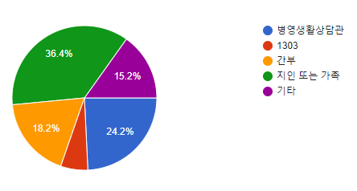
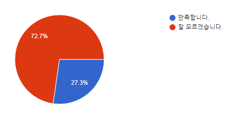
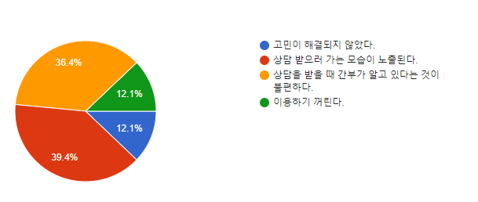

# 사전 조사

## 개요

 본 프로젝트의 문제점 인식 및 사전조사에 대하여 국군 장병들을 대상으로 사전조사를 수행합니다. 본 프로젝트가 수행되기 위해 수집한 정보는 다음과 같습니다.

* [ ] 현재 군에서 제공하는 상담 서비스에 대해 만족하는가?
* [ ] 그렇지 않다면 그 이유는 무엇인가?
* [ ] 그러한 어려움은 어떤 방식으로 해결하고 있는가?

 본 설문조사는 80연대 통신중대 구성원 33명의 장병들을 대상으로 합니다.

 질문을 통하여 본 프로젝트에서 국군 장병들의 상담 주제가 어느 분야에 분포해있고, 이를 통해서 어떠한 주제를 가중치 할지를 결정합니다. 각 질문에 대한 응답 비율은 다음과 같습니다.

## 질문

## 본인은 주로 어느 경로를 통해 상담을 받습니까?

## 군에서 제공하는 상담서비스에 대해 만족하십니까?

## 잘 모르겠다면 그 이유는 무엇입니까?

## 결과

 장병들의 상담 받는 경로를 종합해보면 군에서 제공하는 상담서비스\('병영생활상담관', '1303'\)은 30.2% 밖에 안되는 비율을 보여주며 '간부'를 포함하여도 48.4%로 절반도 안되는 비율을 보여주고 있습니다.

 군에서 제공하는 상담서비스 만족도 비율을 조사한 결과 72.7%로 '잘모르겠다'는 답변이 보이고 있습니다. 그 이유 중 75.8%는 누군가 자신이 상담하러 가는 모습이 노출되는 것, 간부가 자신이 상담을 받고 있는 사실을 알고 있다. 즉, 자신이 상담 받는 것에 대하여 누군가 알고 있다는 사실이 매우 불편하다는 사실을 알 수 있습니다.

