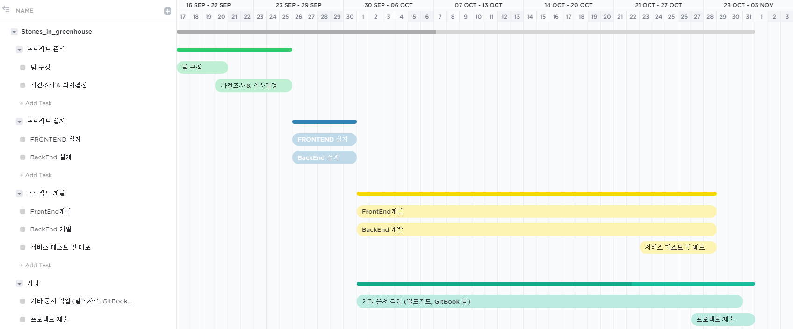

# 워크플로우

* _**프로젝트 준비 \( 9.17 - 9.25 \)**_

 팀 구성과 사전에 필요한 정보, 의사 결정을 하는 구간입니다.

* _**프로젝트 설계 \( 9.26 - 9.30 \)**_

 백엔드와 프론트엔드 각각 입을 맞추어 프로젝트를 설계하는 구간입니다.

* _**프로젝트 개발 \( 10.01 - 10.28 \)**_

 본격적인 개발에 착수하여 테스트 및 배포까지 해보는 구간입니다.

* _**기타 문서 작업 \( 10.01 - 10.31 \)**_

 발표자료, GitBook, Git 등 각종 문서를 관리하고 발표와 서비스 설명에 필요한 전반적인 내용들을 다루는 기간입니다.

